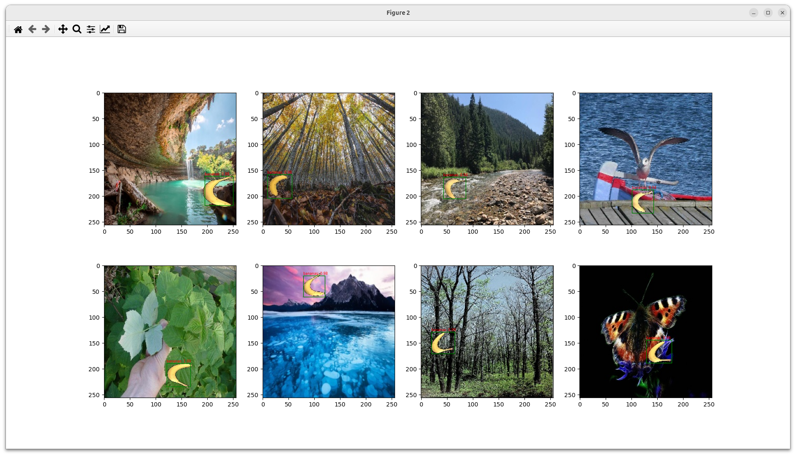
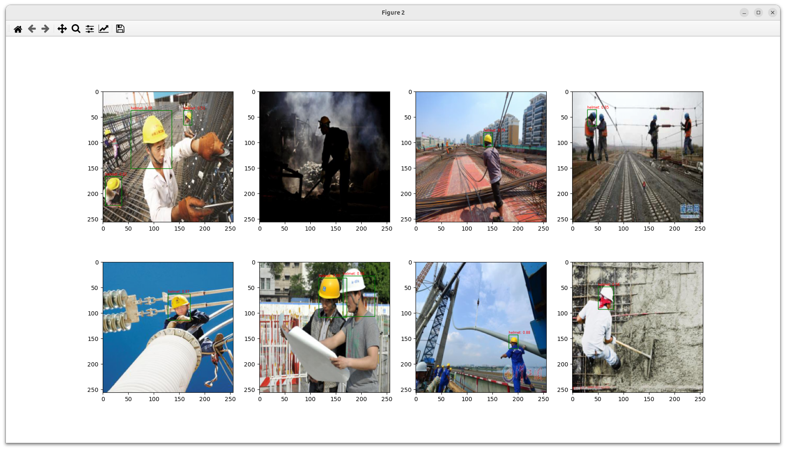

# Spiking YOLO

Спайковая нейросеть для детекции объектов. Основана на библиотеке с открытым исходным кодом [norse](https://github.com/norse/norse/tree/main).

## Запуск

Скачайте репозиторий:

``` bash
git clone https://github.com/KirillHit/spike_yolo.git
cd spike_yolo
```

Создайте виртуальное окружение с помощью [conda](https://docs.conda.io/projects/conda/en/latest/user-guide/install/linux.html):

``` bash
conda env create -f environment.yml
conda activate spike_yolo_env
```

Запустите решение:

``` bash
python3 main.py
```

Далее для выбора датасета, загрузки параметров и запуска обучения/тестирования следуйте указаниям.

## Datasets

### Banana Detection

Содержит размеченные изображения бананов, наложенные на случайные картинки. Представлен в книге [d2l](https://d2l.ai/chapter_computer-vision/object-detection-dataset.html), можно скачать по [ссылке](http://d2l-data.s3-accelerate.amazonaws.com/banana-detection.zip).



### Hardhat  dataset

Размеченные изображения для детекции касок. 


