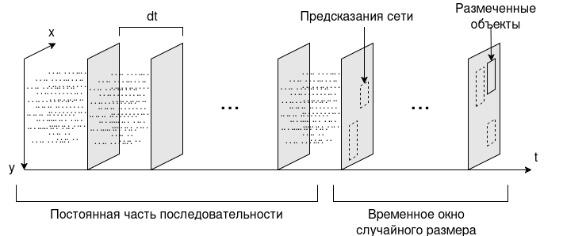

Структура проекта
=================

Проект разделен на четыре модуля:

=============   ===============
:any:`engine`   Содержит класс тренера и интерфейсы для модуля данных и моделей
:any:`models`   Содержит генератор моделей, реализованные модули и конфигурации моделей
:any:`run`      Содержит сценарии запуска
:any:`utils`    Содержит дополнительные инструменты для обработки датасетов, расчетов, вывода и оценки сети
=============   ===============

.. _Startup scripts:

Сценарии запуска
----------------

Для запуска сценария используется скрипт main.py: ``python3 main.py``. Выбор сценария, 
изменение размера пачки и настройка других параметров обучения осуществляется в :doc:`файле конфигурации <config>`. 
Класс :class:`ModelLoader <utils.model_loader.ModelLoader>` используется для чтения файла конфигурации и конструирования объектов.

После инициализации всех объектов вызывается один из следующих сценариев:

==================  ===============
:any:`eval`         Сценарий для оценки качества работы сети. Для оценки используется класс :class:`SODAeval <utils.evaluate.SODAeval>`.
:any:`interactive`  Сценарий интерактивного обучения. Выводит график обучения, позволяет в любой момент
                    приостановить обучение и посмотреть текущие результаты.
:any:`train`        Сценарий фонового обучения. Не создает окон, автоматически сохраняет веса после каждого 
                    раунда и сохраняет график обучение после приостановки. Рекомендуется запускать в tmux или другом мультиплексоре: 
                    ``python3 main.py > log/train.log``. Для завершения вызовите в консоли прерывание: <Ctrl + C>.
==================  ===============

Обработка наборов данных
------------------------

Запись, сделанная на событийною камеру, представляет собой массив событий вида :math:`(t, p, x, y)`, где `t` - время события с начала записи в микросекундах, `p` - позитивное событие (увеличение яркости) или отрицательное, `(x, y)` - координаты пикселя. Ввиду того что матрица событийной камеры асинхронна, между двумя соседними событиями имеется временной промежуток случайного размера с разрешением в одну микросекунду. Для обработки этих данных нейросетью они предварительно упаковываются в последовательность кадров. Каждый кадр представлен в виде двухканального изображения, где первый канал содержит положительные события, а второй отрицательные. Если за время между соседними кадрами происходит событие, то в соответствующий пиксель следующего кадра устанавливается единица. От выбранного временного интервала между кадрами зависит плотность событий на изображении. 

Инструменты для обработки наборов данных находятся в модуле :any:`datasets <utils.datasets>`. Для обучения сети используется модуль данных :class:`STProphesee <utils.datasets.STProphesee>` (Single-target Prophesee), который формирует данные таким образом, чтобы последнему кадру всегда соответствовала разметка. Помимо этого чтобы сеть могла обучиться обработке потокового видео размер последовательности каждую итерацию случайно меняется в рамках указанного временного окна.

Также реализован модуль :class:`MTProphesee <utils.datasets.MTProphesee>` (Multi-target Prophesee), который просто берет из из набора данных отрывки указанного размера и может возвращать разметку для более чем одного кадра.

Структура модели
----------------

Код для генерации модели представлен в модуле :any:`models`. :class:`SODa <models.soda.SODa>` это базовый класс детектора. В нём реализует базовые функции для расчета функции потерь, обучения сети и генерации прогнозов. При этом модель сети передается с параметрами при инициализации. Модель генерируется отдельно на основе конфигурационного списка. Подробнее смотри в :doc:`generator`.